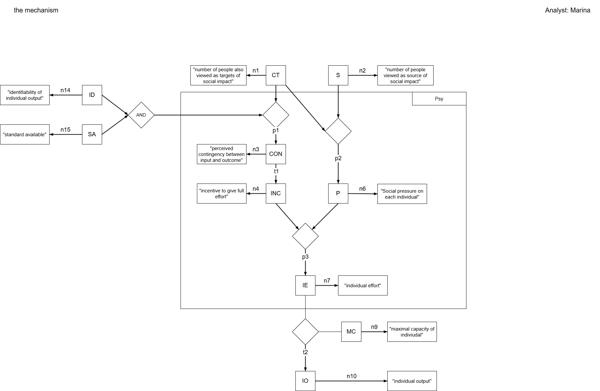
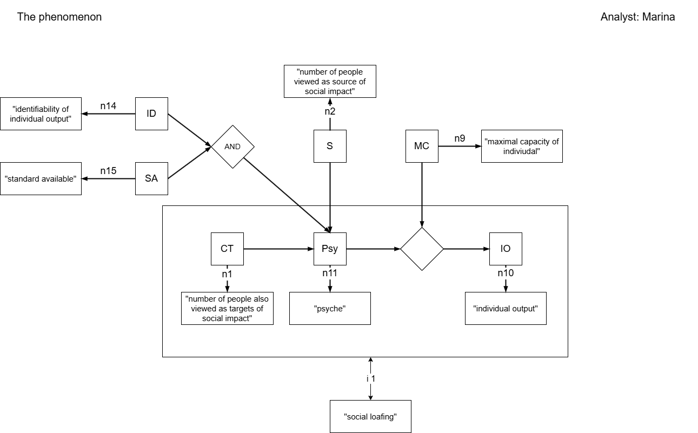
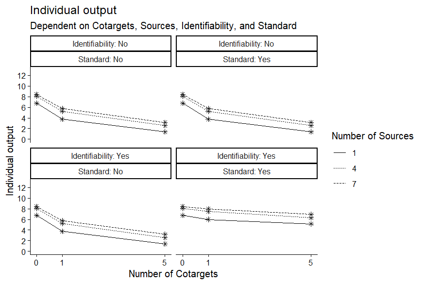

# Social_Loafing
This repository was created as part of a course at the Ludwig-Maximilians-Universität München.\
The goal was to formalize a self-selected theory, whereby we chose Latané’s (1973, as cited in Latané et al., 1979) social impact theory with some extensions.

To guide you through the repository:
- The subfolder _/doc_ contains our VAST displays (as drawio and PNG files) for the mechanism (without and with some jingle-jangle fallacies) and the phenomenon of social loafing.
- The subfolder _/manuscript_ contains the final report.
- The subfolder _/simulation_ contains the R-script with our functions and their plots as well as a simulation. In a separate subfolder are the plots as PNG files.

## VAST displays
### The mechanism
This VAST of the mechanism shows parts of the social impact theory, an extension with CON and INC, which can be described in terms of this theory, and, with ID and SA, an assumption of the elimination of social loafing (Harkins & Jackson, 1985; Karau & Williams, 1993; Latané et al., 1979):\

### The phenomenon
The phenomenon of social loafing:
> [...] people exhibit a sizable decrease in individual effort when performing in groups as compared to when they perform alone [...] (Latané et al., 1979, p. 822)

## Superfunction
This superfunction for individual output (IO) with all measured/manipulated variables does not include random noise.

For the abbreviations, see the VAST-displays above. \
IO drops with increasing CT and grows with increasing S, whereby the nth CT and/or S has less effect than the (1-n)th one. If ID and SA are given, CON is always 1, and therefore IO is higher via INC and IE. If ID and/or SA are not given, IO is usually lower.

## Simulation
For the simulation, which was mentioned above, we wanted to replicate Latané et al. (1979).\
It should be noted that the identifiability of the individual output (ID) and a standard for comparison (SA) are not part of Latané et al.'s (1979) experiment but an extension based on Latané et al.'s (1979) suggestion and Harkins & Jackson (1985).

## Google Docs
This [Google Docs](https://docs.google.com/document/d/1uZwXfztk2ZApD-X8wkGsBsPKZ0mZOGYQWTcuy2yt2g8/edit?pli=1&tab=t.0) contains my working copies of the Construct Table, Variable Table, and Relationship Table.\
The tables can also be found in the final report. It should be noted, though, that the Relationship Table is presented in running text in this report.

## The main paper for this formalization
Latané, B., Williams, K., & Harkins, S. (1979). Many hands make light the work: The causes and consequences of social loafing. Journal of Personality and Social Psychology, 37(6), 822–832. https://doi.org/10.1037/0022-3514.37.6.822

## Other References
Harkins, S. G., & Jackson, J. M. (1985). The Role of Evaluation in Eliminating Social Loafing. Personality and Social Psychology Bulletin, 11(4), 457–465. https://doi.org/10.1177/0146167285114011 \
Karau, S. J., & Williams, K. D. (1993). Social loafing: A meta-analytic review and theoretical integration. Journal of Personality and Social Psychology, 65(4), 681–706. https://doi.org/10.1037/0022-3514.65.4.681 \
Latané, B. (1981). The psychology of social impact. American Psychologist, 36(4), 343–356. https://doi.org/10.1037/0003-066X.36.4.343